# F1 Pit Stop Prediction Report

This document is written in both English and Japanese. The English report appears first, followed by a Japanese translation with the same structure.

Competition page: https://www.kaggle.com/competitions/playground-series-s6e5/overview

## English Report

### 1. Competition Objective

The task was to predict `PitNextLap`, a binary target that indicates whether a Formula 1 car will pit on the next lap. The training data contains historical lap-level records with driver, race, tyre, stint, lap timing, position, and degradation-related variables. The test data has the same explanatory columns but does not include `PitNextLap`; the submission file must provide one prediction per `id`.

Local evaluation focused on OOF AUC. The project explored feature engineering, LightGBM feature selection, CatBoost, XGBoost, and probability/rank blending.

### 1.1 Short Glossary

| Term | Simple explanation |
| --- | --- |
| Feature | A column or derived value used by a model. For example, `TyreLife` is a raw feature, while `tyre_life_ratio` is an engineered feature. |
| Feature engineering | Creating more useful inputs from the original columns. In this project, lap progress, tyre age, race distance, and degradation interactions were important. |
| Cross-validation | Splitting the training data into several folds, training on part of the data, and validating on held-out rows. This estimates whether the model generalizes. |
| OOF prediction | "Out-of-fold" prediction. Each training row is predicted by a model that did not train on that row. This is useful for honest model comparison and blending. |
| AUC | A ranking metric. A higher AUC means the model ranks actual pit-next-lap rows above non-pit rows more often. |
| LightGBM | A fast gradient boosting tree model. It is strong on tabular data and good for many Kaggle competitions. |
| CatBoost | Another gradient boosting tree model. It often handles categorical variables well and can behave differently from LightGBM. |
| XGBoost | A widely used gradient boosting model. It was tested as a third model, but here it was weaker than LightGBM and CatBoost. |
| Ensemble / blend | Combining predictions from multiple models. The best result here was a weighted average of LightGBM and CatBoost probabilities. |
| Leakage | A situation where a feature accidentally contains information that would not be available at prediction time. Suspiciously strong variables must be checked. |

### 2. Data Overview

| Dataset | Rows | Columns | Notes |
| --- | ---: | ---: | --- |
| `data/train.csv` | 439,140 | 16 | Includes the target `PitNextLap`. |
| `data/test.csv` | 188,165 | 15 | Same features as train, without the target. |
| `data/sample_submission.csv` | 188,165 | 2 | Submission template with `id` and `PitNextLap`. |

The target was imbalanced but not extremely rare: `PitNextLap = 1` appeared in 87,381 rows, or 19.90% of the training data.

The raw competition data is not committed to GitHub. Instead, the report keeps the Kaggle competition URL and the repository includes `data/README.md` explaining where to place the downloaded files locally.

### 2.1 Why This Was Run On A Local PC

Most experiments were run on a local PC instead of directly inside a Kaggle Notebook. The practical reason was speed and flexibility: local scripts were easier to run repeatedly, easier to organize into folders, and less constrained by Kaggle Notebook storage/session limits. This made it possible to keep many intermediate artifacts during exploration, compare runs, and only later decide which compact files belonged in GitHub.

### 3. Column Meanings and EDA Summary

The column meanings below are inferred from the CSV schema and values.

| Column | Meaning | Train EDA Summary |
| --- | --- | --- |
| `id` | Unique row identifier. | 439,140 unique train IDs, no missing values; test has 188,165 unique IDs. |
| `Driver` | Driver code or anonymized driver ID. | 887 unique train values, no missing values. Frequent values include `MAS` 1,682, `RAI` 1,669, `BAR` 1,656, `BUT` 1,655. |
| `Compound` | Tyre compound. | 5 values. `MEDIUM` 211,141 rows, `HARD` 170,518, `SOFT` 38,744, `INTERMEDIATE` 17,382, `WET` 1,355. |
| `Race` | Grand Prix / session name. | 26 races. Most frequent: Dutch GP 24,462, Mexico City GP 23,672, Pre-Season Testing 22,492, Hungarian GP 22,481. |
| `Year` | Season year. | 2022-2025. Counts by year: 2022 has 82,989 rows, 2023 has 136,147, 2024 has 127,110, 2025 has 92,894. |
| `PitStop` | Whether the current row is associated with a pit stop event flag. | Binary. Mean is 0.136, so about 13.61% of rows have `PitStop = 1`. |
| `LapNumber` | Lap number in the race/session. | Median 19, mean 23.11, 95th percentile 54, max 78. |
| `Stint` | Stint number. | Median 2, mean 1.79, max 8. Most rows are stint 1 or 2. |
| `TyreLife` | Age of the current tyre in laps. | Median 12, mean 14.16, 95th percentile 32, max 77. |
| `Position` | Track/race position. | Positions 1-20. Median 10, mean 9.63. |
| `LapTime (s)` | Lap time in seconds. | Median 90.521s, mean 90.949s. 99th percentile 124.900s; max 2507.610s indicates extreme outliers. |
| `LapTime_Delta` | Difference from a reference lap time. | Median -0.295, mean -3.770. Extreme min/max values around -2403.89 and 2423.93 suggest outlier laps or special sessions. |
| `Cumulative_Degradation` | Accumulated tyre or pace degradation signal. | Median -20.994, mean -25.722, 95th percentile 84.401, max 2412.030. Large outliers exist. |
| `RaceProgress` | Fraction of race/session completed. | Range about 0.013 to 1.000, median 0.269, mean 0.338. |
| `Position_Change` | Change in position. | Median 0, mean 0.102, range -18 to 18. |
| `PitNextLap` | Target: whether the car pits next lap. | Binary. 351,759 zeros and 87,381 ones; positive rate 19.90%. |

### 4. Basic Trends

| View | Observation | Interpretation |
| --- | --- | --- |
| Target balance | Positive rate is 19.90%. | AUC is appropriate because probability ranking matters more than raw accuracy. |
| Tyre compound | `HARD` has a high next-lap pit rate of 32.75%; `MEDIUM` is 10.11%; `SOFT` is 19.35%; `WET` is 2.51%. | Compound is highly informative, but it interacts with stint, race, and lap progress. |
| Race | Monaco GP has a high next-lap pit rate of 35.74%, Spanish GP 32.00%, Bahrain GP 28.75%; Mexico City GP is 9.07%. | Race-specific strategy and lap structure matter. Race metadata and categorical handling are important. |
| Year | 2023 has a very low target rate of 0.96%, while 2022, 2024, and 2025 are around 26.65%, 29.53%, and 28.44%. | Year distribution is suspiciously different and should be handled carefully to avoid validation artifacts. |
| Stint | Stint 2 has the highest next-lap pit rate at 39.11%; stint 1 is only 5.98%. | Stint number and tyre age jointly encode strategy timing. |
| PitStop flag | Rows with `PitStop = 1` have a 24.78% next-lap pit rate vs 19.13% for `PitStop = 0`. | Useful signal, but it must be checked for leakage-like behavior. |
| Lap time and degradation | `LapTime (s)`, `LapTime_Delta`, and `Cumulative_Degradation` contain very large outliers. | Robust clipping, outlier flags, and careful validation are needed. |

### 5. What Was Done

| Step | What was done | Why it was done | Main result |
| --- | --- | --- | --- |
| 1 | Built an initial LightGBM pipeline. | LightGBM is fast, reliable for tabular data, and useful as a baseline. | A workable modeling and validation loop was created. |
| 2 | Added basic numerical features such as tyre-life ratios, race progress interactions, and lap/time differences. | Pit strategy depends on tyre age, race phase, pace loss, and position context. | Safe numeric features improved early baselines. |
| 3 | Explored outlier flags. | Very slow laps, large lap-time deltas, and degradation extremes could indicate pit windows or abnormal laps. | Some flags had strong target lift, but adding many outlier flags only produced small or unstable gains. |
| 4 | Explored broad feature sets with lag/rolling, race/year, frequency, and target-encoding style features. | These features can capture strategy timing, circuit differences, and repeated patterns by driver/race. | Some broad feature sets improved early experiments, but too many features later hurt generalization. |
| 5 | Ran AB feature selection. | Instead of trusting every engineered feature, each candidate was tested against validation performance. | A compact 21-feature LightGBM model improved over the 14-feature baseline. |
| 6 | Trained CatBoost on the selected features. | CatBoost can model categorical structure differently from LightGBM, so it was a good second model. | CatBoost beat LightGBM as a single model in the main path. |
| 7 | Blended LightGBM and CatBoost probabilities. | If two good models make different errors, averaging their probabilities can improve ranking. | Best OOF AUC was 0.960446 with LightGBM 0.427 / CatBoost 0.573. |
| 8 | Tested rank blending. | Rank blending can help when probability calibration is unreliable. | Probability blending was slightly better in local OOF. |
| 9 | Added lightweight XGBoost. | XGBoost was tested as a third model to add diversity. | Its OOF was much lower, so the final weight search assigned it 0.0. |
| 10 | Tried a stronger CatBoost-2000 run. | Longer CatBoost training might improve the single-model score. | It was strong, but still below the best LightGBM/CatBoost blend. |
| 11 | Cleaned the repository for GitHub. | Data, submissions, OOF arrays, and model binaries were too large or generated. | Only code, reports, and compact run evidence are committed. |

### 6. Results

| Experiment | OOF AUC | Interpretation |
| --- | ---: | --- |
| Stage-2 LightGBM baseline | 0.955756 | Strong baseline from 14 core features. |
| LightGBM AB-selected | 0.958394 | Feature selection improved the LightGBM model. |
| CatBoost on selected features | 0.959197 | Strongest single model in the main path. |
| LightGBM + CatBoost probability blend | 0.960446 | Best OOF result; weights were LightGBM 0.427 and CatBoost 0.573. |
| XGBoost lightweight model | 0.942677 | Too weak to help the final blend. |
| Three-model ensemble | 0.960446 | XGBoost received weight 0.0, so this matched the two-model blend. |
| CatBoost-2000 follow-up | 0.960022 | Strong standalone run, but below the best LightGBM/CatBoost blend. |

### 6.1 What Improved Or Worsened The Score

| Change | Score impact | Evidence | Likely reason |
| --- | --- | --- | --- |
| Safe numeric features | Improved early baseline from about 0.937 to 0.944248. | `experiment_summary.csv` | Tyre age, race progress, lap timing, and degradation are directly related to pit decisions. |
| Outlier flags | Roughly flat to slightly positive. | 0.943686 to 0.943862 in `experiment_summary.csv`; strong target lifts in `outlier_flag_effects_latest.csv`. | Outlier flags captured real pit-window signals, but they were sparse and could overfit special cases. |
| Full feature expansion | Improved modestly to 0.944658 in the early experiment sequence. | `experiment_summary.csv` | Race/year and interaction features added useful context, but the gain was limited. |
| Blind pruning to 150 or 180 features | Worsened by about 0.0010 to 0.0011 vs the full-feature baseline. | `pruned_full_features_model_*` rows in `experiment_summary.csv`. | Importance-based pruning may have removed weak-looking features that still helped in combination. |
| Removing pit-stop features and using target-year stratification | Worsened by about 0.0050. | `no_pitstop_yearstrat_extra_features_model_*` row in `experiment_summary.csv`. | `PitStop` and related timing signals were useful. The changed stratification may also have made validation harder or less aligned with the final target distribution. |
| AB-selected feature set | Improved LightGBM from 0.955756 to 0.958394. | `runs/f1_stage2_ensemble/ab_selected_cv_summary.json`. | Direct feature testing kept only features that improved validation, reducing noise. |
| CatBoost on the same feature set | Improved single-model score to 0.959197. | `runs/f1_lgbm_catboost_ensemble/model_oof_score_report.csv`. | CatBoost handled categorical/rule-like structure differently from LightGBM. |
| LightGBM/CatBoost probability blend | Improved to 0.960446, the best OOF result. | `runs/f1_lgbm_catboost_ensemble/lgbm_catboost_ensemble_summary.json`. | The two models were highly correlated but not identical, so averaging reduced model-specific errors. |
| XGBoost third model | Did not improve; final weight was 0.0. | `runs/f1_xgb_three_model/xgb_three_model_run_summary.json`. | XGBoost OOF was 0.942677, much lower than the other models, so its predictions added noise. |
| CatBoost-2000 follow-up | Strong but not best: 0.960022. | `runs/f1_cat2000_next/next_step_run_summary.json`. | More training improved CatBoost, but it did not add enough diversity to beat the two-model blend. |

### 7. Interpretation

The most useful lesson is that a compact, well-selected feature set beat several broader feature-heavy experiments. Adding many time-series and outlier features did not automatically improve the final model. The model benefited most from combining two strong but not identical learners: LightGBM and CatBoost.

XGBoost added theoretical diversity, but its OOF score was much lower, so the weight search correctly assigned it zero weight. Probability blending worked better than the tested rank blends in local OOF.

The `Year` distribution and the strong race/compound effects deserve careful explanation in any final notebook. They may represent real strategy patterns, generated-data quirks, or validation sensitivity.

The biggest risk in this project is not code execution but interpretation. Some features, especially `PitStop`, `Year`, and target-encoded race combinations, can be very powerful. Powerful features are useful only if they represent information that would be available for the test rows in the same way. For a final public notebook, it is important to say that these variables were monitored for leakage-like behavior and that OOF validation was used to avoid judging models only by training score.

### 8. GitHub File Inventory

The GitHub repository is designed to keep the work understandable and reproducible without committing large generated artifacts.

| Path | What it is | Why it is included |
| --- | --- | --- |
| `README.md` | Project overview and rerun guide. | Gives visitors the entry point. |
| `REPORT.md` | This combined bilingual report. | Keeps the retrospective, EDA, results, and file inventory in one place. |
| `.gitignore` | Ignore rules. | Excludes data, submissions, predictions, models, caches, and local editor files. |
| `.gitattributes` | Text normalization rules. | Keeps line endings stable. |
| `requirements.txt` | Python dependencies. | Documents the expected environment. |
| `src/*.py` | Modeling scripts. | Preserves feature engineering, LightGBM, CatBoost, XGBoost, and ensemble logic. |
| `outlier_analysis.py` | Outlier EDA script. | Documents early outlier investigation. |
| `reports/key_results.csv` | Compact score table. | Summarizes the experiments that mattered. |
| `data/README.md` | Data placement note. | Explains which Kaggle files to place locally. |
| `notebooks/README.md` | Notebook workspace note. | Reserves a place for the later retrospective notebook. |
| `notebooks/kaggle_notebook_guide.md` | Kaggle Notebook writing guide. | Explains the recommended notebook flow, code cells, models, and interpretation in beginner-friendly language. |
| `experiment_summary.csv` | Early experiment chronology. | Shows which feature-heavy/pruning paths helped or failed. |
| `feature_importance_latest.csv` | Feature importance artifact. | Supports later explanation and charts. |
| `feature_effect_report_latest.csv` | Feature effect artifact. | Helps interpret feature behavior. |
| `oof_calibration_by_flags_latest.csv` | Calibration by flags. | Helps diagnose brittleness. |
| `outlier_analysis_report.csv` | Outlier report. | Small EDA artifact from `outlier_analysis.py`. |
| `outlier_flag_effects_latest.csv` | Outlier flag effect report. | Records whether outlier flags helped. |
| `pruning_sweep_summary_latest.csv` | Pruning sweep summary. | Documents unsuccessful pruning paths. |
| `selected_features_latest.json` | Later selected-feature artifact. | Historical comparison artifact. |
| `best_params_latest.json` | Later parameter artifact. | Historical comparison artifact. |
| `runs/f1_stage2_ensemble/*summary/selection small files` | Stage-2 compact artifacts. | Keeps baseline and AB-selected evidence. |
| `runs/f1_lgbm_catboost_ensemble/*summary/weights small files` | CatBoost and blend artifacts. | Records the best two-model path. |
| `runs/f1_weight_variants/*summary/grid small files` | Blend variant artifacts. | Documents probability and rank blend trials. |
| `runs/f1_xgb_three_model/*summary/weights small files` | XGBoost artifacts. | Shows why the third model was not useful. |
| `runs/f1_cat2000_next/*summary/weights small files` | CatBoost-2000 follow-up artifacts. | Preserves the stronger CatBoost comparison. |

Excluded from GitHub: `data/*.csv`, root `submission.csv`, `runs/**/submission*.csv`, OOF/test prediction arrays, model binaries such as `*.cbm`, `.vs/`, `__pycache__/`, and the binary Word document. These are either large, generated, local-only, or better represented in Markdown.

## Japanese Translation

### 1. コンペの目的

このコンペの目的は、F1 の車両が次のラップでピットインするかどうかを表す二値目的変数 `PitNextLap` を予測することです。学習データには、ドライバー、レース、タイヤ、スティント、ラップタイム、順位、劣化に関するラップ単位の情報が含まれています。テストデータには同じ説明変数がありますが、`PitNextLap` は含まれていません。提出ファイルでは `id` ごとに予測値を出します。

ローカル評価では主に OOF AUC を見ました。特徴量エンジニアリング、LightGBM の特徴量選択、CatBoost、XGBoost、確率ブレンドと順位ブレンドを試しました。

### 1.1 専門用語ミニ解説

| 用語 | やさしい説明 |
| --- | --- |
| 特徴量 | モデルに入力する列や、列から作った値です。例として `TyreLife` は元の特徴量、`tyre_life_ratio` は作った特徴量です。 |
| 特徴量エンジニアリング | 元の列から、予測に役立ちそうな新しい列を作ることです。このコンペではレース進行率、タイヤ寿命、ラップ差、劣化の組み合わせが重要でした。 |
| クロスバリデーション | 学習データをいくつかに分け、一部で学習し、残りで検証する方法です。未知データにどれくらい強いかを見ます。 |
| OOF予測 | Out-of-fold 予測のことです。その行を学習に使っていないモデルで予測するため、モデル比較やブレンドに使いやすいです。 |
| AUC | 正例を負例より上に順位付けできているかを見る指標です。高いほど、ピットインする行をうまく上位に置けています。 |
| LightGBM | 表形式データに強い高速な木モデルです。Kaggle のようなコンペでよく使われます。 |
| CatBoost | カテゴリ変数の扱いが得意な木モデルです。LightGBM と違う間違い方をする可能性があるため、ブレンド候補にしました。 |
| XGBoost | 有名な木モデルです。今回は3つ目のモデル候補として試しましたが、LightGBM/CatBoost より弱かったです。 |
| アンサンブル / ブレンド | 複数モデルの予測を混ぜることです。今回は LightGBM と CatBoost の確率を重み付き平均したものが最良でした。 |
| リーク | 本来予測時に使えない情報が特徴量に混ざることです。強すぎる特徴量は注意して確認する必要があります。 |

### 2. データ概要

| データ | 行数 | 列数 | 内容 |
| --- | ---: | ---: | --- |
| `data/train.csv` | 439,140 | 16 | 目的変数 `PitNextLap` を含む学習データ。 |
| `data/test.csv` | 188,165 | 15 | 学習データと同じ説明変数。目的変数はない。 |
| `data/sample_submission.csv` | 188,165 | 2 | `id` と `PitNextLap` を持つ提出テンプレート。 |

目的変数は不均衡ですが、極端にまれではありません。`PitNextLap = 1` は 87,381 行で、学習データ全体の 19.90% でした。

コンペデータ本体は GitHub には入れていません。その代わり、レポートに Kaggle コンペ URL を残し、`data/README.md` にローカルでどこへ置くかを書いています。

### 2.1 ローカルPCで実行した理由

多くの実験は Kaggle Notebook 上ではなく、ローカルPCで実行しました。理由は、ローカルの方がスクリプトを何度も回しやすく、フォルダごとに結果を整理しやすく、Kaggle Notebook の容量やセッション制限をあまり気にせず試せたからです。探索中は中間ファイルが多く出るため、まずローカルで自由に実験し、最後に GitHub に残すべき小さな成果物だけを選ぶ方針にしました。

### 3. 各列の意味と EDA 要約

以下の列説明は、CSV の列名と値から推定したものです。

| 列 | 意味 | 学習データでの EDA 要約 |
| --- | --- | --- |
| `id` | 行ごとの一意な識別子。 | 学習データで 439,140 個すべて一意。欠損なし。テストも 188,165 個すべて一意。 |
| `Driver` | ドライバーコード、または匿名化されたドライバーID。 | 887 種類。欠損なし。多い値は `MAS` 1,682、`RAI` 1,669、`BAR` 1,656、`BUT` 1,655。 |
| `Compound` | タイヤコンパウンド。 | 5 種類。`MEDIUM` 211,141 行、`HARD` 170,518 行、`SOFT` 38,744 行、`INTERMEDIATE` 17,382 行、`WET` 1,355 行。 |
| `Race` | グランプリまたはセッション名。 | 26 種類。多いものは Dutch GP 24,462、Mexico City GP 23,672、Pre-Season Testing 22,492、Hungarian GP 22,481。 |
| `Year` | シーズン年。 | 2022-2025。2022 年 82,989 行、2023 年 136,147 行、2024 年 127,110 行、2025 年 92,894 行。 |
| `PitStop` | 現在行がピットストップに関連するかを示すフラグ。 | 二値。平均 0.136 なので、約 13.61% が `PitStop = 1`。 |
| `LapNumber` | レースまたはセッション内のラップ番号。 | 中央値 19、平均 23.11、95 パーセンタイル 54、最大 78。 |
| `Stint` | スティント番号。 | 中央値 2、平均 1.79、最大 8。多くはスティント 1 または 2。 |
| `TyreLife` | 現在のタイヤの使用ラップ数。 | 中央値 12、平均 14.16、95 パーセンタイル 32、最大 77。 |
| `Position` | 走行順位。 | 1-20 位。中央値 10、平均 9.63。 |
| `LapTime (s)` | ラップタイム秒。 | 中央値 90.521 秒、平均 90.949 秒。99 パーセンタイル 124.900 秒、最大 2507.610 秒で大きな外れ値がある。 |
| `LapTime_Delta` | 基準ラップタイムとの差分。 | 中央値 -0.295、平均 -3.770。最小 -2403.89、最大 2423.93 で、特殊なラップやセッション由来の外れ値がある。 |
| `Cumulative_Degradation` | 累積のタイヤまたはペース劣化シグナル。 | 中央値 -20.994、平均 -25.722、95 パーセンタイル 84.401、最大 2412.030。大きな外れ値がある。 |
| `RaceProgress` | レースまたはセッションの進行率。 | 約 0.013 から 1.000。中央値 0.269、平均 0.338。 |
| `Position_Change` | 順位変化。 | 中央値 0、平均 0.102、範囲は -18 から 18。 |
| `PitNextLap` | 目的変数。次ラップでピットインするか。 | 二値。0 が 351,759 行、1 が 87,381 行。陽性率 19.90%。 |

### 4. 基本的な傾向

| 観点 | 観察結果 | 解釈 |
| --- | --- | --- |
| 目的変数の比率 | 陽性率は 19.90%。 | 単純な正解率よりも、確率の順位付けを見る AUC が適している。 |
| タイヤコンパウンド | `HARD` の次ラップピット率は 32.75%、`MEDIUM` は 10.11%、`SOFT` は 19.35%、`WET` は 2.51%。 | コンパウンドは強い特徴量だが、スティント、レース、進行率との相互作用が重要。 |
| レース | Monaco GP は 35.74%、Spanish GP は 32.00%、Bahrain GP は 28.75%。Mexico City GP は 9.07%。 | レースごとの戦略やラップ構造が効いている。レース情報とカテゴリ処理が重要。 |
| 年 | 2023 年は 0.96% と非常に低く、2022/2024/2025 年は 26.65%、29.53%、28.44%。 | 年による分布差が大きい。実際の傾向、生成データの癖、検証設計の影響を慎重に見る必要がある。 |
| スティント | スティント 2 の次ラップピット率が 39.11% と最も高く、スティント 1 は 5.98%。 | スティント番号とタイヤ寿命は、戦略タイミングを強く表している。 |
| `PitStop` フラグ | `PitStop = 1` は 24.78%、`PitStop = 0` は 19.13%。 | 有用なシグナルだが、リークに近い挙動がないか確認が必要。 |
| ラップタイムと劣化 | `LapTime (s)`, `LapTime_Delta`, `Cumulative_Degradation` には大きな外れ値がある。 | クリッピング、外れ値フラグ、慎重な検証が必要。 |

### 5. 実施したこと

| 手順 | 何をしたか | なぜやったか | 結果 |
| --- | --- | --- | --- |
| 1 | LightGBM の初期パイプラインを作成。 | LightGBM は表形式データに強く、速く、ベースラインに向いているため。 | 学習、検証、提出作成の流れを作れた。 |
| 2 | タイヤ寿命比、レース進行率との掛け算、ラップ/時間差などの基本特徴量を追加。 | ピット戦略はタイヤの古さ、レースのどの時点か、ペース低下、順位状況に関係するため。 | 初期ベースラインが改善した。 |
| 3 | 外れ値フラグを探索。 | 極端に遅いラップや劣化の大きな値は、ピット直前や特殊ラップのサインになり得るため。 | 強い lift を持つフラグはあったが、入れすぎると安定した改善にはなりにくかった。 |
| 4 | ラグ/ローリング、Race/Year、頻度、ターゲットエンコーディング系の広い特徴量を試した。 | ドライバー、レース、年、タイヤの組み合わせに戦略パターンがあると考えたため。 | 一部は改善したが、特徴量を増やしすぎると汎化性能が悪化した。 |
| 5 | AB テスト型の特徴量選択を実施。 | すべての特徴量を信じるのではなく、検証スコアで採用可否を見たかったため。 | 21 個の特徴量で LightGBM が 14 特徴量ベースラインより改善した。 |
| 6 | 同じ選択特徴量で CatBoost を学習。 | CatBoost はカテゴリ構造を LightGBM と違う形で扱えるため。 | 単体モデルとして LightGBM を上回った。 |
| 7 | LightGBM と CatBoost の確率をブレンド。 | 良いモデル同士でも間違い方が少し違えば、平均で誤差を減らせるため。 | LightGBM 0.427 / CatBoost 0.573 で OOF AUC 0.960446。 |
| 8 | 順位ブレンドを試した。 | 確率の校正が怪しい場合は、順位だけを混ぜる方が効く場合があるため。 | 今回は確率ブレンドの方が少し良かった。 |
| 9 | 軽量 XGBoost を追加。 | 3つ目のモデルとして多様性を増やせるか見たかったため。 | OOF が低く、最終重みは 0.0 になった。 |
| 10 | CatBoost 2000 iteration の追加実験を実施。 | CatBoost を長めに学習すれば単体性能が上がる可能性があったため。 | 強かったが、最良の2モデルブレンドには届かなかった。 |
| 11 | GitHub 用にリポジトリを整理。 | データ、提出物、OOF配列、モデル本体は大きい、または生成可能なため。 | コード、レポート、小さな結果要約だけを残した。 |

### 6. 結果

| 実験 | OOF AUC | 解釈 |
| --- | ---: | --- |
| Stage-2 LightGBM baseline | 0.955756 | 14 個の基本特徴量で強いベースライン。 |
| LightGBM AB-selected | 0.958394 | 特徴量選択により LightGBM が改善。 |
| CatBoost on selected features | 0.959197 | メインの流れで最も強い単体モデル。 |
| LightGBM + CatBoost probability blend | 0.960446 | 最良の OOF。重みは LightGBM 0.427、CatBoost 0.573。 |
| XGBoost lightweight model | 0.942677 | 最終ブレンドを改善するには弱かった。 |
| Three-model ensemble | 0.960446 | XGBoost の重みは 0.0 で、実質的に 2 モデルブレンドと同じ。 |
| CatBoost-2000 follow-up | 0.960022 | 強い単体追加実験だが、最良の LightGBM/CatBoost ブレンドには届かなかった。 |

### 6.1 何がスコアを改善し、何が悪化させたか

| 変更 | スコアへの影響 | 根拠 | 推測理由 |
| --- | --- | --- | --- |
| 安全な数値特徴量 | 初期ベースラインを約 0.937 から 0.944248 へ改善。 | `experiment_summary.csv` | タイヤ寿命、レース進行率、ラップタイム、劣化はピット判断に直接関係するため。 |
| 外れ値フラグ | ほぼ横ばいから微改善。 | `experiment_summary.csv` と `outlier_flag_effects_latest.csv` | ピット直前に近いサインを拾えたが、該当行が少なく特殊ケースに寄りやすかったため。 |
| 広い特徴量追加 | 初期実験では 0.944658 まで小幅改善。 | `experiment_summary.csv` | レース/年/組み合わせ特徴量が文脈を追加したため。ただし効果は限定的。 |
| 重要度ベースの pruning | full-feature 比で約 0.0010 から 0.0011 悪化。 | `pruned_full_features_model_*` の行 | 単体では弱く見えるが組み合わせで効く特徴量を落とした可能性があるため。 |
| `PitStop` 系を落とし、target-year stratification を使った実験 | 約 0.0050 悪化。 | `no_pitstop_yearstrat_extra_features_model_*` の行 | `PitStop` やタイミング系が有用だったこと、また検証分割が最終分布と合いにくくなった可能性。 |
| AB-selected の特徴量セット | LightGBM が 0.955756 から 0.958394 に改善。 | `runs/f1_stage2_ensemble/ab_selected_cv_summary.json` | 検証で効いた特徴量だけを残し、ノイズを減らせたため。 |
| CatBoost の追加 | 単体で 0.959197 まで改善。 | `runs/f1_lgbm_catboost_ensemble/model_oof_score_report.csv` | LightGBM とは違うカテゴリ処理・分割の仕方で、有効なパターンを拾えたため。 |
| LightGBM/CatBoost 確率ブレンド | 最良の 0.960446 まで改善。 | `runs/f1_lgbm_catboost_ensemble/lgbm_catboost_ensemble_summary.json` | 2モデルの予測は似ているが完全には同じでなく、平均で個別の誤差を減らせたため。 |
| XGBoost の追加 | 改善せず、最終重み 0.0。 | `runs/f1_xgb_three_model/xgb_three_model_run_summary.json` | XGBoost の OOF が 0.942677 と低く、混ぜるとノイズになったため。 |
| CatBoost-2000 | 強いが最良ではない 0.960022。 | `runs/f1_cat2000_next/next_step_run_summary.json` | 単体性能は高いが、2モデルブレンドを超えるほどの多様性や改善はなかったため。 |

### 7. 解釈

最も重要な学びは、広く大量の特徴量を入れるよりも、よく選ばれたコンパクトな特徴量セットの方が有効だったことです。時系列特徴量や外れ値特徴量を多く足しても、自動的に最終性能が上がるわけではありませんでした。性能向上に最も効いたのは、LightGBM と CatBoost という強く、かつ完全には同じでない 2 つの学習器を組み合わせることでした。

XGBoost は多様性を増やす候補でしたが、OOF が低かったため、重み探索では 0 が割り当てられました。ローカル OOF では、試した範囲では順位ブレンドより確率ブレンドの方が良い結果でした。

`Year` の分布差、レースごとの違い、コンパウンドの強い影響は、最終 notebook で丁寧に説明すべきです。これらは実際の戦略差、生成データの癖、または検証設計への感度を表している可能性があります。

このプロジェクトで一番注意すべき点は、コードが動くかどうかよりも「その特徴量をどう解釈するか」です。`PitStop`、`Year`、Race/Year を含むターゲットエンコード系特徴量は非常に強い可能性があります。強い特徴量は便利ですが、予測時にも同じ意味で使える情報なのかを確認する必要があります。最終 notebook では、これらをリークに近い挙動がないか注意して見たこと、学習スコアではなく OOF 検証で判断したことを書くべきです。

### 8. GitHub に入れるファイル一覧

GitHub には、内容を理解し再実行できる最小構成だけを入れ、大きな生成物は入れない方針です。

| パス | 何のファイルか | なぜ入れるか |
| --- | --- | --- |
| `README.md` | プロジェクト概要と再実行手順。 | リポジトリの入口として必要。 |
| `REPORT.md` | この一体型の二言語レポート。 | 振り返り、EDA、結果、ファイル一覧を一箇所にまとめるため。 |
| `.gitignore` | Git の除外ルール。 | データ、提出物、予測、モデル、キャッシュ、ローカル設定を除外するため。 |
| `.gitattributes` | テキスト正規化ルール。 | 改行コードを安定させるため。 |
| `requirements.txt` | Python 依存ライブラリ。 | 実行環境を再現しやすくするため。 |
| `src/*.py` | モデリング用スクリプト。 | 特徴量作成、LightGBM、CatBoost、XGBoost、アンサンブル処理を残すため。 |
| `outlier_analysis.py` | 外れ値 EDA スクリプト。 | 初期の外れ値調査を残すため。 |
| `reports/key_results.csv` | 主要スコアの小さな表。 | 重要な実験結果をすぐ確認できるようにするため。 |
| `data/README.md` | データ配置メモ。 | Kaggle データをどこに置くか示すため。 |
| `notebooks/README.md` | notebook 用フォルダのメモ。 | 後で振り返り notebook を置く場所を明示するため。 |
| `notebooks/kaggle_notebook_guide.md` | Kaggle Notebook 作成ガイド。 | Notebook の流れ、コードセル、モデル、解釈を初見でも分かるように説明するため。 |
| `experiment_summary.csv` | 初期実験の時系列まとめ。 | どの特徴量追加や pruning が効いたか、効かなかったかを見るため。 |
| `feature_importance_latest.csv` | 特徴量重要度。 | 後の説明やグラフ作成に使えるため。 |
| `feature_effect_report_latest.csv` | 特徴量効果レポート。 | 特徴量の挙動を説明するため。 |
| `oof_calibration_by_flags_latest.csv` | フラグ別キャリブレーション。 | モデルの弱い部分を見るため。 |
| `outlier_analysis_report.csv` | 外れ値レポート。 | `outlier_analysis.py` の小さな EDA 成果物として残すため。 |
| `outlier_flag_effects_latest.csv` | 外れ値フラグ効果。 | 外れ値フラグが効いたかを記録するため。 |
| `pruning_sweep_summary_latest.csv` | pruning sweep の要約。 | うまくいかなかった pruning の記録として必要。 |
| `selected_features_latest.json` | 後半実験の選択特徴量。 | 履歴比較のため。 |
| `best_params_latest.json` | 後半実験のパラメータ。 | 履歴比較のため。 |
| `runs/f1_stage2_ensemble/` の小さな要約ファイル | stage-2 のベースラインと AB-selected の記録。 | LightGBM 改善の根拠を残すため。 |
| `runs/f1_lgbm_catboost_ensemble/` の小さな要約・重みファイル | CatBoost と 2 モデルブレンドの記録。 | 最良経路を説明するため。 |
| `runs/f1_weight_variants/` の小さな要約・グリッドファイル | ブレンド候補の記録。 | 確率ブレンドと順位ブレンドの比較のため。 |
| `runs/f1_xgb_three_model/` の小さな要約・重みファイル | XGBoost 追加実験。 | 3 モデル目が効かなかった理由を残すため。 |
| `runs/f1_cat2000_next/` の小さな要約・重みファイル | CatBoost-2000 追加実験。 | 強い追加実験との比較を残すため。 |

GitHub に入れないものは、`data/*.csv`、ルートの `submission.csv`、`runs/**/submission*.csv`、OOF/test 予測配列、`*.cbm` などのモデル本体、`.vs/`、`__pycache__/`、バイナリの Word 文書です。これらは大きい、生成可能、ローカル専用、または Markdown の方がレビューしやすいものです。

<!-- EDA_START -->
# EDA Report / 探索的データ分析

このセクションは `make_eda_report.py` によって自動生成されています。目的は、`id` を除く全カラムについて、分布・目的変数との関係・データセット間の分布差を確認することです。

## 1. Data Overview / データ概要

| dataset           |   rows |   columns |   missing_cells |   missing_pct |   duplicate_rows |
|:------------------|-------:|----------:|----------------:|--------------:|-----------------:|
| train             | 439140 |        16 |               0 |             0 |                0 |
| test              | 188165 |        15 |               0 |             0 |                0 |
| sample_submission | 188165 |         2 |               0 |             0 |                0 |

`train` はモデル学習用、`test` は提出予測用、`sample_submission` は提出形式確認用です。`original` が読み込まれている場合は、Playgroundのsynthetic dataとは別系統の元データとして、分布比較や追加学習データ候補の確認に使います。

## 2. Target Overview / 目的変数の確認

**目的変数の分布 / Target distribution**

`PitNextLap` のクラス比率を確認するグラフ。AUC評価ではクラス比率そのものより、正例をどれだけ上位に並べられるかが重要です。

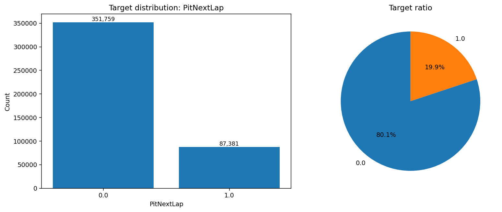

## 3. Column Summary / カラム一覧

| column                 | role    | dtype   |   missing |   missing_pct |   unique | sample_values                                                                                         |
|:-----------------------|:--------|:--------|----------:|--------------:|---------:|:------------------------------------------------------------------------------------------------------|
| id                     | id      | int64   |         0 |             0 |   439140 | 0, 1, 2, 3, 4                                                                                         |
| Driver                 | feature | str     |         0 |             0 |      887 | D109, D086, ZON, SPE, D019                                                                            |
| Compound               | feature | str     |         0 |             0 |        5 | HARD, MEDIUM, INTERMEDIATE, SOFT, WET                                                                 |
| Race                   | feature | str     |         0 |             0 |       26 | Canadian Grand Prix, Dutch Grand Prix, Austrian Grand Prix, Pre-Season Testing, Azerbaijan Grand Prix |
| Year                   | feature | int64   |         0 |             0 |        4 | 2022, 2025, 2023, 2024                                                                                |
| PitStop                | feature | int64   |         0 |             0 |        2 | 0, 1                                                                                                  |
| LapNumber              | feature | int64   |         0 |             0 |       78 | 50, 27, 59, 2, 26                                                                                     |
| Stint                  | feature | int64   |         0 |             0 |        8 | 2, 3, 1, 4, 5                                                                                         |
| TyreLife               | feature | float64 |         0 |             0 |       78 | 39.0, 7.0, 22.0, 2.0, 6.0                                                                             |
| Position               | feature | int64   |         0 |             0 |       20 | 8, 4, 13, 7, 2                                                                                        |
| LapTime (s)            | feature | float64 |         0 |             0 |    37719 | 78.491, 75.095, 70.945, 94.361, 107.878                                                               |
| LapTime_Delta          | feature | float64 |         0 |             0 |    57532 | -7.564000000000007, -32.617000000000004, -7.540000000000006, -7.323999999999998, 8.965000000000003    |
| Cumulative_Degradation | feature | float64 |         0 |             0 |   142701 | 21.019000000000005, -223.207, -100.529, -7.323999999999998, -14.138999999999996                       |
| RaceProgress           | feature | float64 |         0 |             0 |     1898 | 0.7142857142857143, 0.3461538461538461, 0.8194444444444444, 0.0769230769230769, 0.3611111111111111    |
| Position_Change        | feature | float64 |         0 |             0 |       37 | 5.0, -3.0, 3.0, 0.0, -9.0                                                                             |
| PitNextLap             | target  | float64 |         0 |             0 |        2 | 1.0, 0.0                                                                                              |

## 4. Correlation / 相関関係

### 4.1 Correlation with Target / 目的変数との相関

| column                 |   corr_with_target |   abs_corr_with_target |
|:-----------------------|-------------------:|-----------------------:|
| TyreLife               |             0.2735 |                 0.2735 |
| LapNumber              |             0.2671 |                 0.2671 |
| Stint                  |             0.1982 |                 0.1982 |
| RaceProgress           |             0.1855 |                 0.1855 |
| Cumulative_Degradation |            -0.1674 |                 0.1674 |
| Year                   |             0.1253 |                 0.1253 |
| PitStop                |             0.0486 |                 0.0486 |
| Position_Change        |             0.0462 |                 0.0462 |
| LapTime (s)            |            -0.0341 |                 0.0341 |
| Position               |             0.0213 |                 0.0213 |
| LapTime_Delta          |            -0.0049 |                 0.0049 |

**数値変数同士の相関 / Numeric correlation heatmap**

数値変数同士の相関を確認します。相関が高すぎる特徴量は、似た情報を持っている可能性があります。

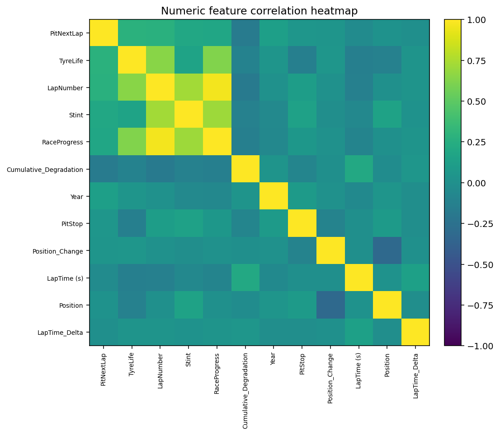

**目的変数 `PitNextLap` との相関**

各数値変数と `PitNextLap` の線形相関を確認します。ただし、非線形な関係は相関係数だけでは見えない点に注意します。

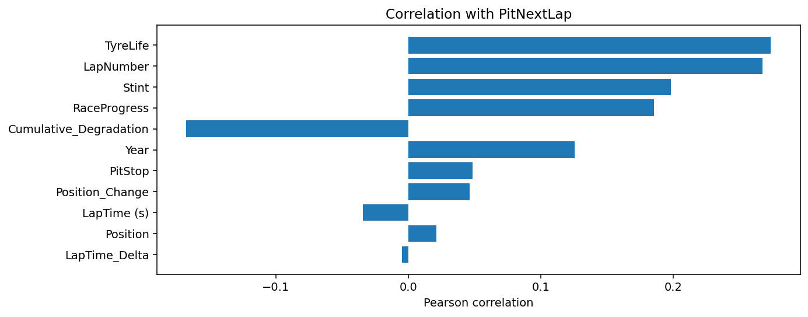

### 4.2 Category-wise Target Rate / カテゴリ別目的変数率

カテゴリ変数や離散値について、カテゴリ別の件数と平均目的変数率を確認します。

| column   | category                  |   count |   pit_rate |
|:---------|:--------------------------|--------:|-----------:|
| Compound | HARD                      |  170518 |     0.3275 |
| Compound | SOFT                      |   38744 |     0.1935 |
| Compound | INTERMEDIATE              |   17382 |     0.1523 |
| Compound | MEDIUM                    |  211141 |     0.1011 |
| Compound | WET                       |    1355 |     0.0251 |
| Driver   | NOR                       |    1563 |     0.2834 |
| Driver   | WEB                       |    1576 |     0.2563 |
| Driver   | BUT                       |    1655 |     0.2453 |
| Driver   | TRU                       |    1613 |     0.2436 |
| Driver   | RAI                       |    1669 |     0.2427 |
| Driver   | BIA                       |    1539 |     0.2359 |
| Driver   | KOV                       |    1607 |     0.2358 |
| Driver   | KUB                       |    1650 |     0.2339 |
| Driver   | PIQ                       |    1493 |     0.2338 |
| Driver   | MAS                       |    1682 |     0.2313 |
| Driver   | CHI                       |    1505 |     0.2306 |
| Driver   | HEI                       |    1587 |     0.2294 |
| Driver   | BUE                       |    1508 |     0.2288 |
| Driver   | GLO                       |    1509 |     0.2286 |
| Driver   | BER                       |    1489 |     0.2277 |
| Driver   | ALG                       |    1527 |     0.2266 |
| Driver   | DIR                       |    1495 |     0.2254 |
| Driver   | NAK                       |    1534 |     0.2243 |
| Driver   | PET                       |    1493 |     0.223  |
| Driver   | GUT                       |    1529 |     0.2224 |
| Driver   | SUT                       |    1579 |     0.2217 |
| Driver   | D001                      |    1498 |     0.2203 |
| Driver   | FIS                       |    1651 |     0.2199 |
| Driver   | BAR                       |    1656 |     0.2198 |
| Driver   | MAL                       |    1494 |     0.2195 |
| PitStop  | 1.0                       |   59775 |     0.2478 |
| PitStop  | 0.0                       |  379365 |     0.1913 |
| Position | 13.0                      |   24850 |     0.2351 |
| Position | 14.0                      |   23824 |     0.2299 |
| Position | 15.0                      |   23905 |     0.2199 |
| Position | 16.0                      |   21769 |     0.2134 |
| Position | 8.0                       |   24777 |     0.2072 |
| Position | 9.0                       |   24416 |     0.2065 |
| Position | 17.0                      |   19886 |     0.2045 |
| Position | 11.0                      |   25031 |     0.2038 |
| Position | 12.0                      |   24937 |     0.2005 |
| Position | 10.0                      |   24700 |     0.1955 |
| Position | 7.0                       |   24690 |     0.1951 |
| Position | 5.0                       |   24398 |     0.1928 |
| Position | 3.0                       |   24285 |     0.1927 |
| Position | 6.0                       |   24845 |     0.1902 |
| Position | 2.0                       |   21427 |     0.1899 |
| Position | 18.0                      |   15869 |     0.1888 |
| Position | 4.0                       |   25267 |     0.1785 |
| Position | 19.0                      |   10615 |     0.1689 |
| Position | 1.0                       |   23841 |     0.1593 |
| Position | 20.0                      |    5808 |     0.1541 |
| Race     | Chinese Grand Prix        |    7311 |     0.3886 |
| Race     | Monaco Grand Prix         |   21539 |     0.3574 |
| Race     | Spanish Grand Prix        |   20483 |     0.32   |
| Race     | Bahrain Grand Prix        |   19535 |     0.2875 |
| Race     | Belgian Grand Prix        |    9002 |     0.2804 |
| Race     | Emilia Romagna Grand Prix |   15483 |     0.2726 |
| Race     | São Paulo Grand Prix      |   11497 |     0.2537 |
| Race     | Hungarian Grand Prix      |   22481 |     0.2393 |
| Race     | Saudi Arabian Grand Prix  |   18111 |     0.2274 |
| Race     | Las Vegas Grand Prix      |   12479 |     0.2253 |
| Race     | Azerbaijan Grand Prix     |   12126 |     0.2146 |
| Race     | Japanese Grand Prix       |   12891 |     0.204  |
| Race     | Austrian Grand Prix       |   21223 |     0.1881 |
| Race     | Australian Grand Prix     |   18406 |     0.1816 |
| Race     | Dutch Grand Prix          |   24462 |     0.1761 |
| Race     | Qatar Grand Prix          |   13817 |     0.1756 |
| Race     | Canadian Grand Prix       |   21416 |     0.1539 |
| Race     | Abu Dhabi Grand Prix      |   16427 |     0.1505 |
| Race     | Pre-Season Testing        |   22492 |     0.1465 |
| Race     | Singapore Grand Prix      |   18960 |     0.1418 |
| Race     | British Grand Prix        |   15383 |     0.1335 |
| Race     | Italian Grand Prix        |   19854 |     0.132  |
| Race     | United States Grand Prix  |   18045 |     0.114  |
| Race     | Miami Grand Prix          |   18860 |     0.1036 |
| Race     | Mexico City Grand Prix    |   23672 |     0.0907 |
| Stint    | 2.0                       |  129536 |     0.3911 |
| Stint    | 3.0                       |   69238 |     0.2931 |
| Stint    | 4.0                       |   18903 |     0.1717 |

## 5. Per-column EDA / 各カラムの詳細EDA

以下では `id` を除く全カラムについて、型に合わせてヒストグラム、箱ひげ図、棒グラフ、円グラフ、線グラフなどを使って確認します。

### Driver

- Type: `categorical_high_cardinality`

- dtype: `str`

- Missing: 0 (0.00%)

- Unique values: 887

`Driver` はカテゴリ変数です。ユニーク数は 887 で、件数が多いカテゴリは MAS (1,682), RAI (1,669), BAR (1,656), BUT (1,655), FIS (1,651) です。 十分な件数があるカテゴリの中では、`PitNextLap`率が高い例は STR: 42.75%, BEA: 40.00%, ALO: 39.32%、低い例は D198: 13.18%, D186: 13.33%, D201: 13.37% です。

**Driver の頻度と目的変数との関係**

カテゴリカラム `Driver` について、カテゴリ頻度、カテゴリ別 `PitNextLap` 率、必要に応じて円グラフを確認します。

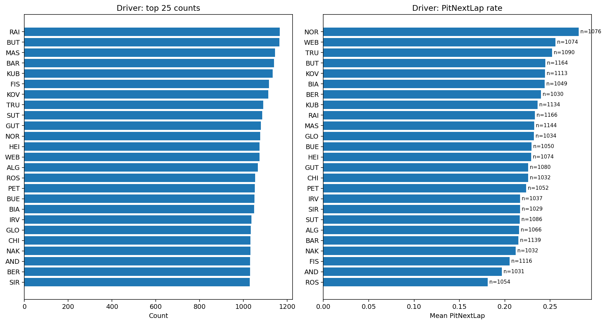

### Compound

- Type: `categorical`

- dtype: `str`

- Missing: 0 (0.00%)

- Unique values: 5

`Compound` はカテゴリ変数です。ユニーク数は 5 で、件数が多いカテゴリは MEDIUM (211,141), HARD (170,518), SOFT (38,744), INTERMEDIATE (17,382), WET (1,355) です。 十分な件数があるカテゴリの中では、`PitNextLap`率が高い例は HARD: 32.75%, SOFT: 19.35%, INTERMEDIATE: 15.23%、低い例は WET: 2.51%, MEDIUM: 10.11%, INTERMEDIATE: 15.23% です。

**Compound の頻度と目的変数との関係**

カテゴリカラム `Compound` について、カテゴリ頻度、カテゴリ別 `PitNextLap` 率、必要に応じて円グラフを確認します。

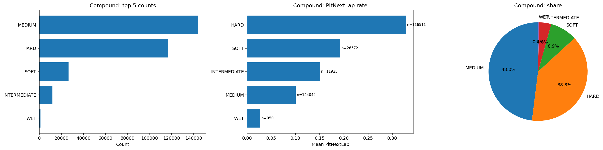

### Race

- Type: `categorical`

- dtype: `str`

- Missing: 0 (0.00%)

- Unique values: 26

`Race` はカテゴリ変数です。ユニーク数は 26 で、件数が多いカテゴリは Dutch Grand Prix (24,462), Mexico City Grand Prix (23,672), Pre-Season Testing (22,492), Hungarian Grand Prix (22,481), Monaco Grand Prix (21,539) です。 十分な件数があるカテゴリの中では、`PitNextLap`率が高い例は Chinese Grand Prix: 38.86%, Monaco Grand Prix: 35.74%, Spanish Grand Prix: 32.00%、低い例は Mexico City Grand Prix: 9.07%, Miami Grand Prix: 10.36%, United States Grand Prix: 11.40% です。

**Race の頻度と目的変数との関係**

カテゴリカラム `Race` について、カテゴリ頻度、カテゴリ別 `PitNextLap` 率、必要に応じて円グラフを確認します。

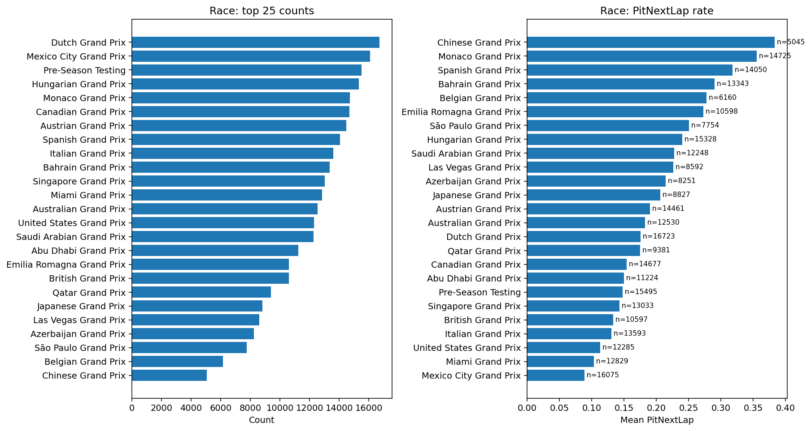

### Year

- Type: `numeric_discrete_or_ordinal`

- dtype: `int64`

- Missing: 0 (0.00%)

- Unique values: 4

`Year` は数値変数です。中央値は 2024.0000、平均は 2023.5235、範囲は 2022.0000 〜 2025.0000 です。 `PitNextLap` との相関は 0.1253 です。 クラス別平均は PitNextLap=0.0: 2023.4596, PitNextLap=1.0: 2023.7811 です。

**Year の分布と目的変数との関係**

数値カラム `Year` について、分布、`PitNextLap` 別の箱ひげ図、bin別の平均 `PitNextLap` を確認します。

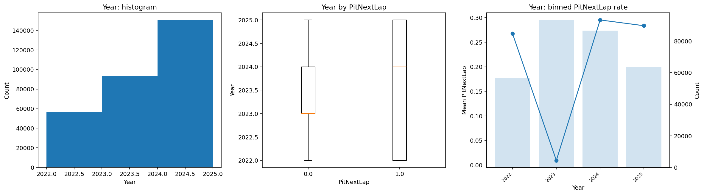

### PitStop

- Type: `numeric_discrete_or_ordinal`

- dtype: `int64`

- Missing: 0 (0.00%)

- Unique values: 2

`PitStop` は数値変数です。中央値は 0.0000、平均は 0.1361、範囲は 0.0000 〜 1.0000 です。 `PitNextLap` との相関は 0.0486 です。 クラス別平均は PitNextLap=0.0: 0.1278, PitNextLap=1.0: 0.1695 です。

**PitStop の分布と目的変数との関係**

数値カラム `PitStop` について、分布、`PitNextLap` 別の箱ひげ図、bin別の平均 `PitNextLap` を確認します。

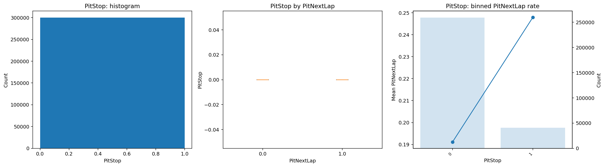

### LapNumber

- Type: `numeric_continuous`

- dtype: `int64`

- Missing: 0 (0.00%)

- Unique values: 78

`LapNumber` は数値変数です。中央値は 19.0000、平均は 23.1059、範囲は 1.0000 〜 78.0000 です。 `PitNextLap` との相関は 0.2671 です。 クラス別平均は PitNextLap=0.0: 20.8487, PitNextLap=1.0: 32.1925 です。

**LapNumber の分布と目的変数との関係**

数値カラム `LapNumber` について、分布、`PitNextLap` 別の箱ひげ図、bin別の平均 `PitNextLap` を確認します。

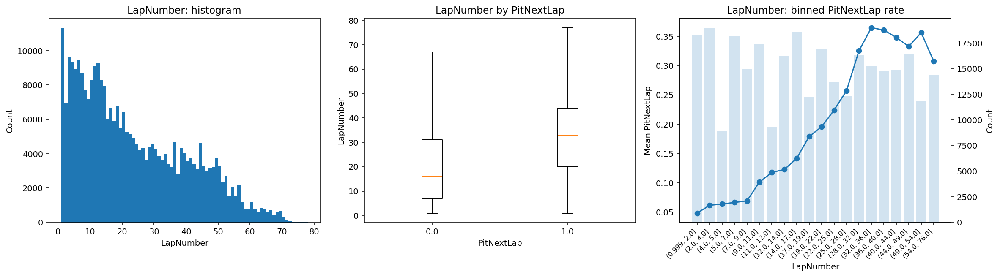

### Stint

- Type: `numeric_discrete_or_ordinal`

- dtype: `int64`

- Missing: 0 (0.00%)

- Unique values: 8

`Stint` は数値変数です。中央値は 2.0000、平均は 1.7891、範囲は 1.0000 〜 8.0000 です。 `PitNextLap` との相関は 0.1982 です。 クラス別平均は PitNextLap=0.0: 1.6953, PitNextLap=1.0: 2.1670 です。

**Stint の分布と目的変数との関係**

数値カラム `Stint` について、分布、`PitNextLap` 別の箱ひげ図、bin別の平均 `PitNextLap` を確認します。

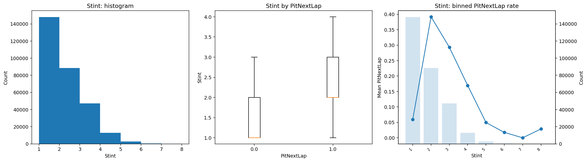

### TyreLife

- Type: `numeric_continuous`

- dtype: `float64`

- Missing: 0 (0.00%)

- Unique values: 78

`TyreLife` は数値変数です。中央値は 12.0000、平均は 14.1582、範囲は 1.0000 〜 77.0000 です。 `PitNextLap` との相関は 0.2735 です。 クラス別平均は PitNextLap=0.0: 12.8221, PitNextLap=1.0: 19.5369 です。

**TyreLife の分布と目的変数との関係**

数値カラム `TyreLife` について、分布、`PitNextLap` 別の箱ひげ図、bin別の平均 `PitNextLap` を確認します。

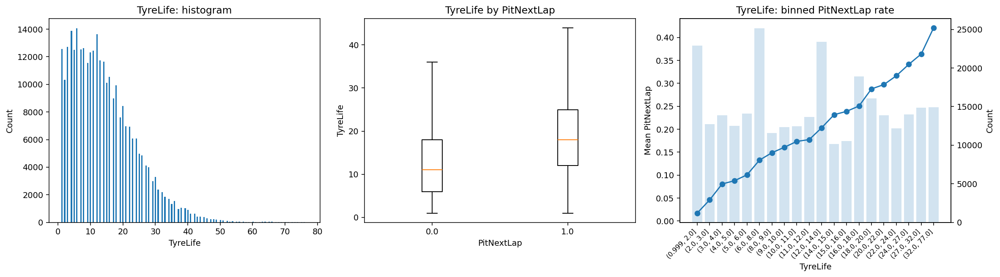

### Position

- Type: `numeric_discrete_or_ordinal`

- dtype: `int64`

- Missing: 0 (0.00%)

- Unique values: 20

`Position` は数値変数です。中央値は 10.0000、平均は 9.6303、範囲は 1.0000 〜 20.0000 です。 `PitNextLap` との相関は 0.0213 です。 クラス別平均は PitNextLap=0.0: 9.5742, PitNextLap=1.0: 9.8564 です。

**Position の分布と目的変数との関係**

数値カラム `Position` について、分布、`PitNextLap` 別の箱ひげ図、bin別の平均 `PitNextLap` を確認します。

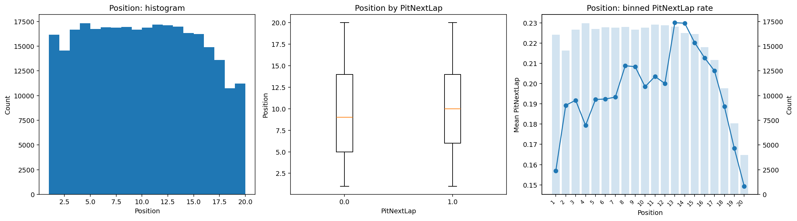

### LapTime (s)

- Type: `numeric_continuous`

- dtype: `float64`

- Missing: 0 (0.00%)

- Unique values: 37,719

`LapTime (s)` は数値変数です。中央値は 90.5210、平均は 90.9487、範囲は 67.6940 〜 2507.6070 です。 `PitNextLap` との相関は -0.0341 です。 クラス別平均は PitNextLap=0.0: 91.2847, PitNextLap=1.0: 89.5961 です。

**LapTime (s) の分布と目的変数との関係**

数値カラム `LapTime (s)` について、分布、`PitNextLap` 別の箱ひげ図、bin別の平均 `PitNextLap` を確認します。

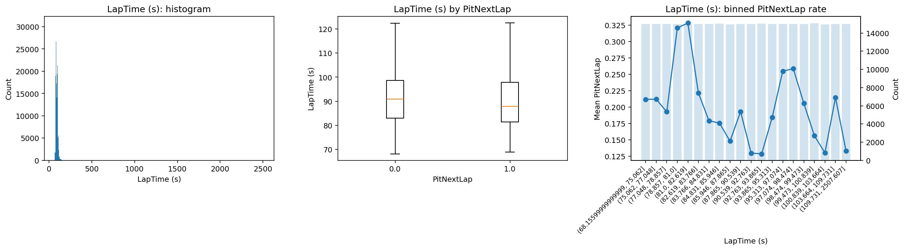

### LapTime_Delta

- Type: `numeric_continuous`

- dtype: `float64`

- Missing: 0 (0.00%)

- Unique values: 57,532

`LapTime_Delta` は数値変数です。中央値は -0.2950、平均は -3.7700、範囲は -2403.8950 〜 2423.9320 です。 `PitNextLap` との相関は -0.0049 です。 クラス別平均は PitNextLap=0.0: -3.6617, PitNextLap=1.0: -4.2062 です。

**LapTime_Delta の分布と目的変数との関係**

数値カラム `LapTime_Delta` について、分布、`PitNextLap` 別の箱ひげ図、bin別の平均 `PitNextLap` を確認します。

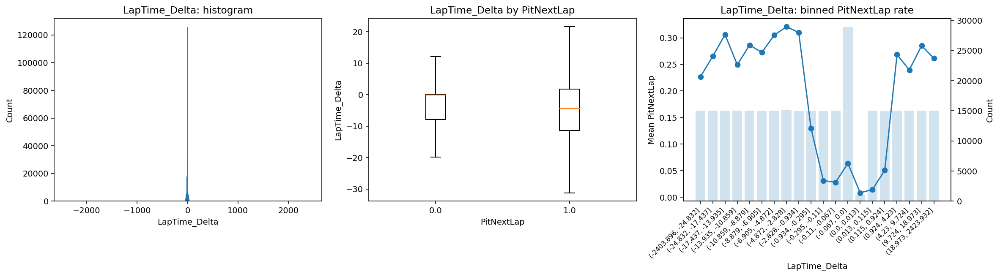

### Cumulative_Degradation

- Type: `numeric_continuous`

- dtype: `float64`

- Missing: 0 (0.00%)

- Unique values: 142,701

`Cumulative_Degradation` は数値変数です。中央値は -20.9940、平均は -25.7218、範囲は -274.5640 〜 2412.0260 です。 `PitNextLap` との相関は -0.1674 です。 クラス別平均は PitNextLap=0.0: -21.1524, PitNextLap=1.0: -44.1162 です。

**Cumulative_Degradation の分布と目的変数との関係**

数値カラム `Cumulative_Degradation` について、分布、`PitNextLap` 別の箱ひげ図、bin別の平均 `PitNextLap` を確認します。

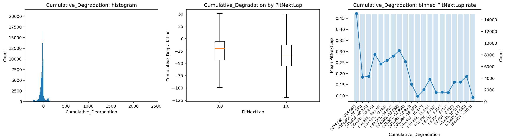

### RaceProgress

- Type: `numeric_continuous`

- dtype: `float64`

- Missing: 0 (0.00%)

- Unique values: 1,898

`RaceProgress` は数値変数です。中央値は 0.2692、平均は 0.3377、範囲は 0.0128 〜 1.0000 です。 `PitNextLap` との相関は 0.1855 です。 クラス別平均は PitNextLap=0.0: 0.3142, PitNextLap=1.0: 0.4319 です。

**RaceProgress の分布と目的変数との関係**

数値カラム `RaceProgress` について、分布、`PitNextLap` 別の箱ひげ図、bin別の平均 `PitNextLap` を確認します。

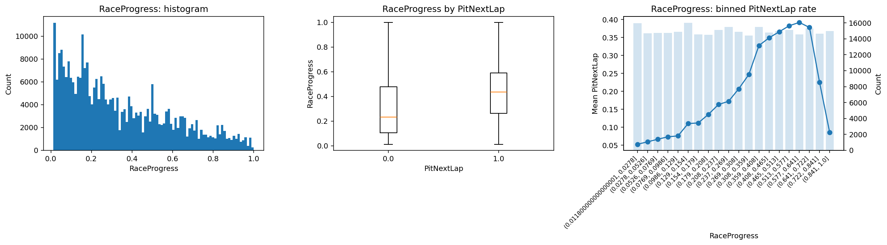

### Position_Change

- Type: `numeric_discrete_or_ordinal`

- dtype: `float64`

- Missing: 0 (0.00%)

- Unique values: 37

`Position_Change` は数値変数です。中央値は 0.0000、平均は 0.1015、範囲は -18.0000 〜 18.0000 です。 `PitNextLap` との相関は 0.0462 です。 クラス別平均は PitNextLap=0.0: 0.0092, PitNextLap=1.0: 0.4732 です。

**Position_Change の分布と目的変数との関係**

数値カラム `Position_Change` について、分布、`PitNextLap` 別の箱ひげ図、bin別の平均 `PitNextLap` を確認します。

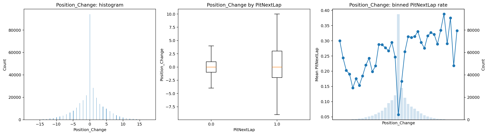

## 6. Train/Test/Original Distribution Comparison / データセット間の分布比較

train/test/original の分布が大きく違うカラムは、Public LBとCVのズレや、外部データ追加時の悪化につながる可能性があります。

**train/test/original 分布比較: Driver**

`Driver` について、train/test/original の分布差を確認します。分布差が大きい場合、CVとPublic LBのズレや汎化性能低下につながる可能性があります。

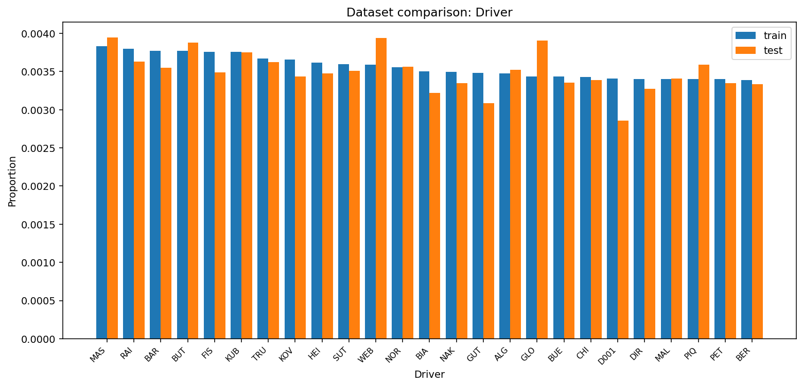

**train/test/original 分布比較: Compound**

`Compound` について、train/test/original の分布差を確認します。分布差が大きい場合、CVとPublic LBのズレや汎化性能低下につながる可能性があります。

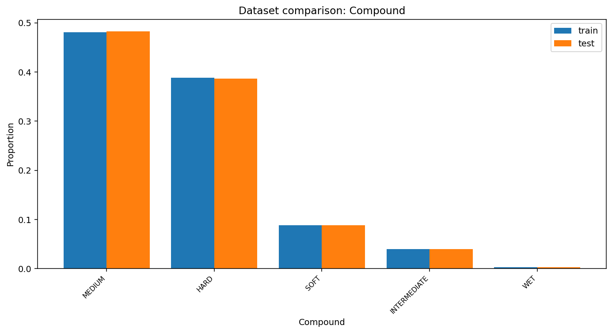

**train/test/original 分布比較: Race**

`Race` について、train/test/original の分布差を確認します。分布差が大きい場合、CVとPublic LBのズレや汎化性能低下につながる可能性があります。

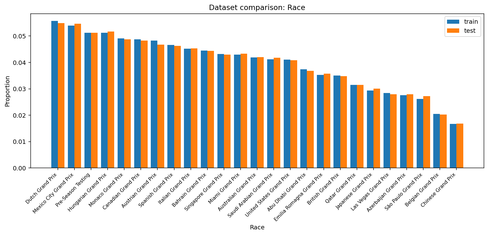

**train/test/original 分布比較: Year**

`Year` について、train/test/original の分布差を確認します。分布差が大きい場合、CVとPublic LBのズレや汎化性能低下につながる可能性があります。

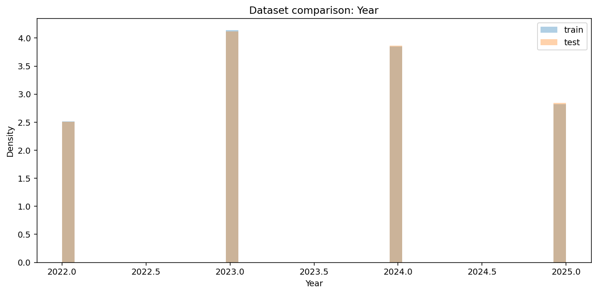

**train/test/original 分布比較: PitStop**

`PitStop` について、train/test/original の分布差を確認します。分布差が大きい場合、CVとPublic LBのズレや汎化性能低下につながる可能性があります。

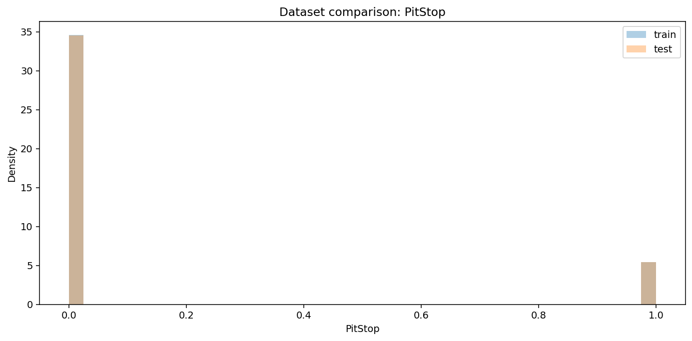

**train/test/original 分布比較: LapNumber**

`LapNumber` について、train/test/original の分布差を確認します。分布差が大きい場合、CVとPublic LBのズレや汎化性能低下につながる可能性があります。

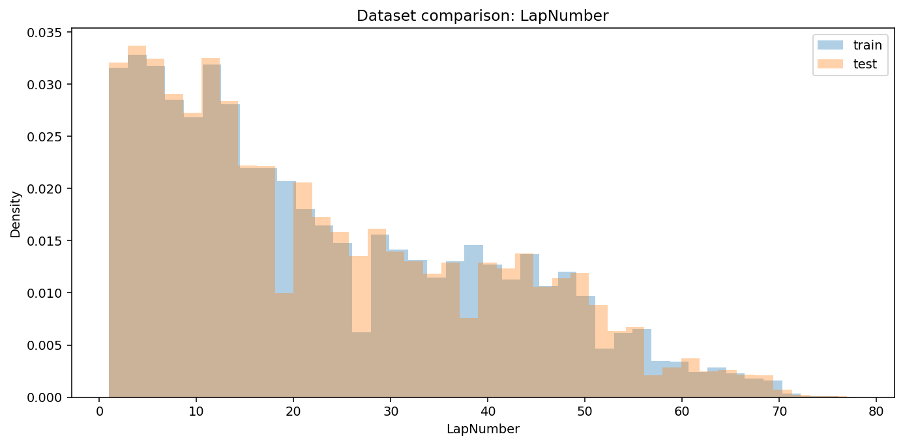

**train/test/original 分布比較: Stint**

`Stint` について、train/test/original の分布差を確認します。分布差が大きい場合、CVとPublic LBのズレや汎化性能低下につながる可能性があります。

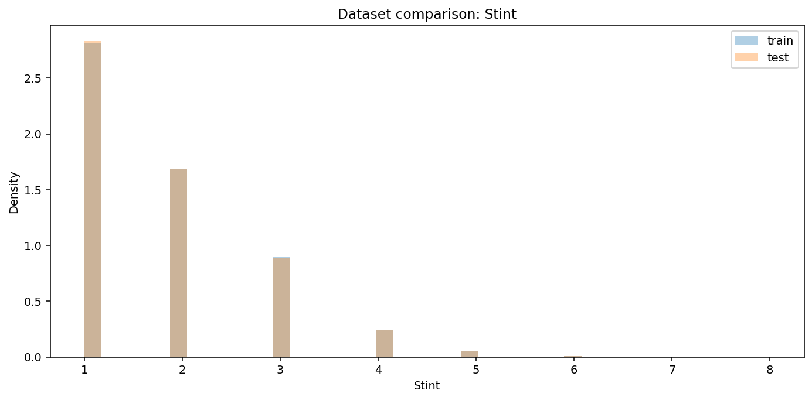

**train/test/original 分布比較: TyreLife**

`TyreLife` について、train/test/original の分布差を確認します。分布差が大きい場合、CVとPublic LBのズレや汎化性能低下につながる可能性があります。

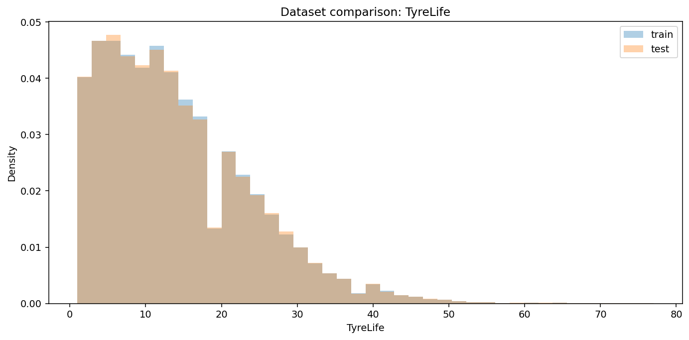

**train/test/original 分布比較: Position**

`Position` について、train/test/original の分布差を確認します。分布差が大きい場合、CVとPublic LBのズレや汎化性能低下につながる可能性があります。

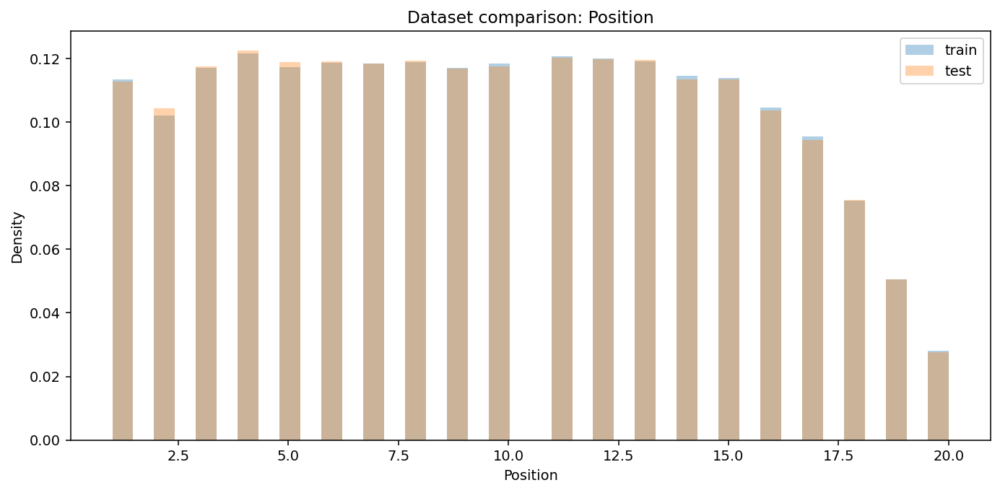

**train/test/original 分布比較: LapTime (s)**

`LapTime (s)` について、train/test/original の分布差を確認します。分布差が大きい場合、CVとPublic LBのズレや汎化性能低下につながる可能性があります。

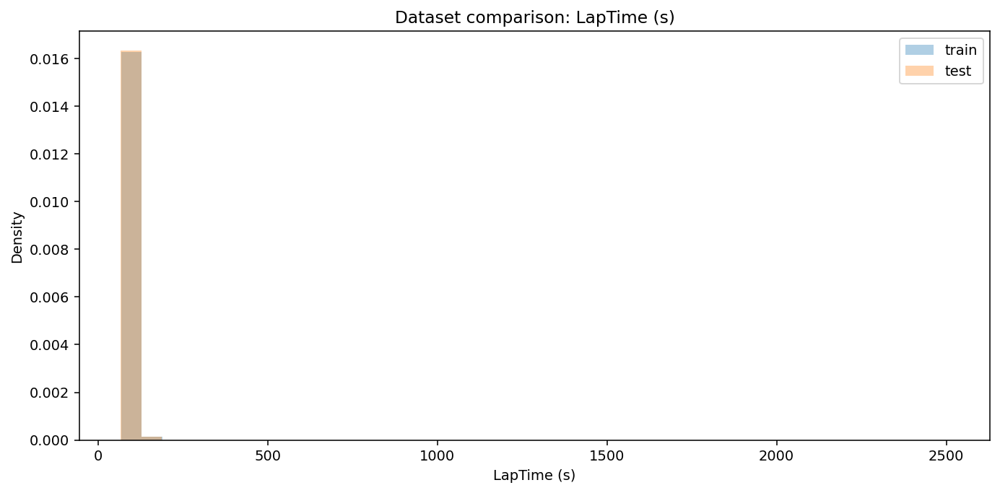

**train/test/original 分布比較: LapTime_Delta**

`LapTime_Delta` について、train/test/original の分布差を確認します。分布差が大きい場合、CVとPublic LBのズレや汎化性能低下につながる可能性があります。

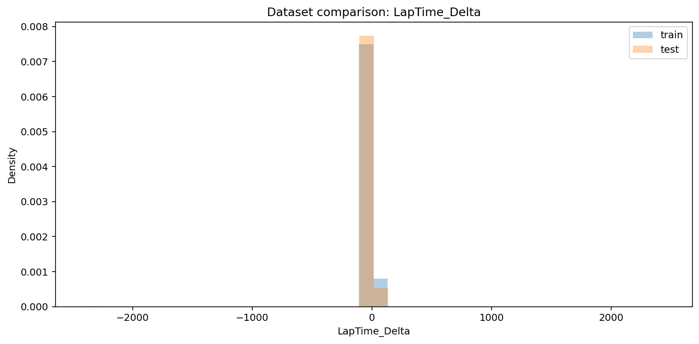

**train/test/original 分布比較: Cumulative_Degradation**

`Cumulative_Degradation` について、train/test/original の分布差を確認します。分布差が大きい場合、CVとPublic LBのズレや汎化性能低下につながる可能性があります。

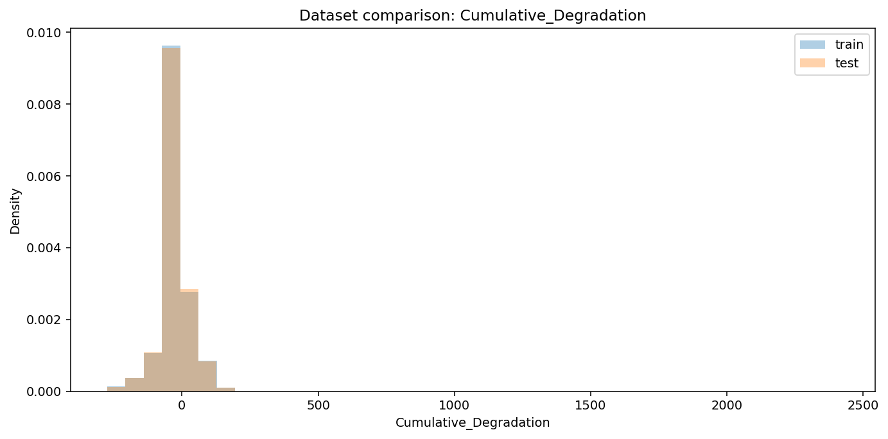

**train/test/original 分布比較: RaceProgress**

`RaceProgress` について、train/test/original の分布差を確認します。分布差が大きい場合、CVとPublic LBのズレや汎化性能低下につながる可能性があります。

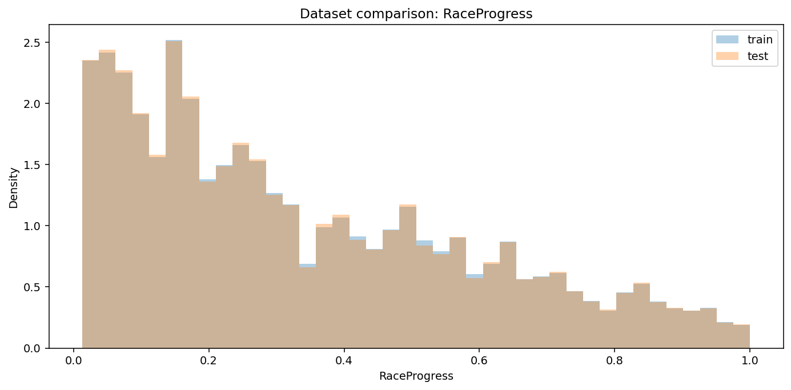

**train/test/original 分布比較: Position_Change**

`Position_Change` について、train/test/original の分布差を確認します。分布差が大きい場合、CVとPublic LBのズレや汎化性能低下につながる可能性があります。

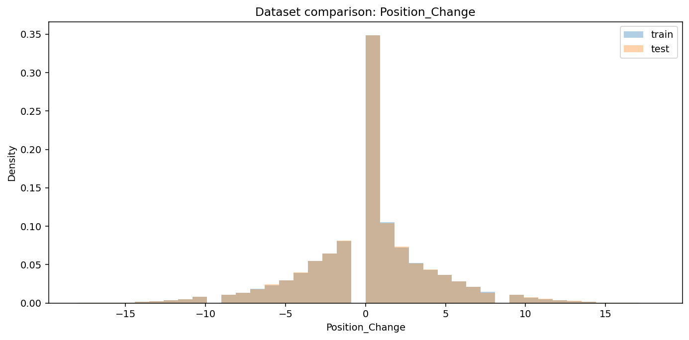

## 7. Notes for Feature Engineering / 特徴量作成への示唆

EDAで重要なのは、単にグラフを見ることではなく、`なぜ次のラップでピットするのか` という発生メカニズムに結びつけることです。たとえば、TyreLife、LapNumber、RaceProgress、Stint、Compound、Race、Position系の変数は、ピット戦略の理由と直接つながりやすい候補です。一方で、相関が低い変数でも、LightGBMやCatBoostのような木系モデルでは非線形な条件分岐として効く場合があります。

<!-- EDA_END -->
